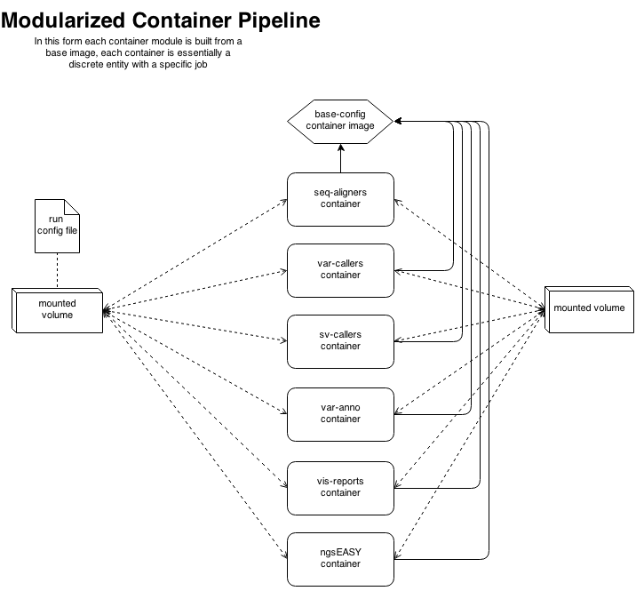

NGS EASY v1.0
===================

Dockerized ngs pipeline..under construction....  

As a multi-component system, NGS pipeline setup is traditionally heavy on 
configuration. Our idea is to provide this in a simple encapsulated container. 
Users also typically wish to configure their own environments and run the 
pipeline on a wide range of hardware (workstations to clusters to cloud), being 
able to stand-up a pipeline with minimal fuss is made straightforward with this 
container.

### Authors
Amos Folarin <amosfolarin@gmail.com> 
Stephen J Newhouse <stephen.j.newhouse@gmail.com>

******

# NOTICE TO USERS OF THE CONTAINER IMAGE 

While the software used to build the image is composed of free software versions
some of the software has restrictions on use particularly for commercial 
purposes. Therefore if you wish to use this for commercial purposes, then you 
leagally have to approach the owners of the various components yourself!

This pipeline uses a number of pieces of software which require registration. 
By using this you are agreeing to observe the Terms and Conditions of the 
relevant pieces of software that compose this pipeline.

# Software composing the pipeline requiring registration

If you want to build the image from the Dockerfile then you need to get your 
own versions of (below) in the build directory:

   * novoalign http://www.novocraft.com/
   * Stampy http://www.well.ox.ac.uk/project-stampy
   * GATK https://www.broadinstitute.org/gatk/
   * ANNOVAR http://www.openbioinformatics.org/annovar/

******

Overview of Pipeline Components
================================
The basic pipeline contains all the basic tools needed for manipulation and 
quality control of raw fastq files (ILLUMINA focused), SAM/BAM manipulation,
alignment, cleaning (based on GATK best practises [ADD LINK]) and first pass
variant discovery. Separate containers are provided for indepth variant annotation,
structural variant calling, basic reporting and visualisations.  




The Tools included are as follows :- 

### Fastq manipulation
- FASTQC
- SEQTK
- TRIMMOMATIC
- FASTX TOOLKIT

### Alignmnet
- BWA
- BOWTIE2
- STAMPY
- NOVOALIGN [FULL VERSION NOT AVAILABLE FOR PUBLIC USE]

### SAM/BAM Processing
- GATK
- PICARDTOOLS
- SAMTOOLS

### MISC
- BEDTOOLS
- VCFTOOLS
- BCFTOOLS

### VARIANT CALLING
- GATK
- SAMTOOLS/BCFTOOLS
- FREEBAYES
- PLATYPUS

### VARIANT ANNOTATION
- ANNOVAR
- SNPEFF
- VEP

### CNV/Structural Variant CALLING
- lumpy-sv
- delly
- m-HMM
- CNVnator
- ExomeDepth

****

##### To Add 
- SegSeq
- MuTect
- MutSig

******

Getting the NGS Pipeline
=========================

Available NGSEASY containers:- 
 
- afolarin/seq-alignment
- afolarin/var-calling
- afolarin/sv-calling
- afolarin/var-anno
- afolarin/vis-reports
- delly

```bash
sudo docker pull afolarin/seq-alignment
```

## NGSEASY-VM : An NGS Tool Box
A virtual machine based on ubuntu 14.04 containing all these tools (and a few extras) is available on request.
Using [VirtualBox](https://www.virtualbox.org/) and our NGSEASY-VM you can have a full suite of NGS tools up and running on any high end workstation in less than an hour.

******

Running the NGS Pipeline
==========================

```bash
sudo docker run \
-v ~/FASTQ_STAGGING:~/FASTQ_STAGGING \
-v ~/reference_geneomes:~/reference_genomes \
-v ~/ngs_projects:~/ngs_projects \
-u pipeman -t [CONTAINER] ngs.config
```

******

User set up
========================

1. On local machine, make the following directories:-

- FASTQ_STAGGING [FASTQ_STAGGING is to hold all incoming raw fastq files]
- ngs_projects [out put directory for all ngs projects)
- reference_genomes [get from URL and unpack. NB: XXX GB!]
- gatk_resources
- humandb [annovar]
- vep [VEP data base]
- snpeff [snpeff database]

These folders are required by pipeline as they are hardcoded in the nsg scripts.

- Get reference genomes, gatk resouces, snp annotation databases from [ADD URL]
- Un compress and save on local machine


******

```
This program is free software: you can redistribute it and/or modify
it under the terms of the GNU General Public License as published by
the Free Software Foundation, either version 3 of the License, or
(at your option) any later version.

This program is distributed in the hope that it will be useful,
but WITHOUT ANY WARRANTY; without even the implied warranty of
MERCHANTABILITY or FITNESS FOR A PARTICULAR PURPOSE.  See the
GNU General Public License for more details.

You should have received a copy of the GNU General Public License
along with this program.  If not, see <http://www.gnu.org/licenses/>.
```

